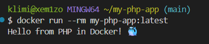

# my-php-app

Учебный проект с CI на GitHub Actions для PHP-приложения.

## 📌 Цель работы

Настроить CI для PHP-проекта: проверка синтаксиса, unit-тесты (PHPUnit), сборка Docker-образа с сохранением в артефакт.

## 🎯 Что делает CI

Три job'а:

1. **Syntax Check** — `php -l` для всех `.php` файлов
2. **Run Tests** — `phpunit tests/`
3. **Build Docker Image** — сборка образа + сохранение `.tar.gz` + тестовый запуск

## 📂 Структура проекта

```
my-php-app/
├── .github/
│   └── workflows/
│       └── ci.yml
├── src/
│   └── index.php
├── tests/
│   └── test.php
├── Dockerfile
├── .dockerignore
└── README.md
```

## 🐘 Основной код

**`src/index.php`:**
```php
<?php

function getGreeting() {
    return "Hello from PHP in Docker! 🐳";
}

echo getGreeting() . PHP_EOL;
```

## 🚀 Запуск локально

### Через Docker

```bash
docker build -t my-php-app:latest .
docker run --rm my-php-app:latest
```

Ожидаемый вывод:
```
Hello from PHP in Docker! 🐳
```

## 📸 Результат запуска



## ✅ Результат

При каждом push в `main` запускается CI.
На вкладке **Actions** отображаются 🟢 зелёные галочки.

**Ссылка на Actions:**  
https://github.com/xem1zo/my-php-app/actions

Дополнительно сохраняется артефакт `docker-image` (`.tar.gz`) на 7 дней.

## 📝 Вывод

В ходе работы я освоил:

- Настройку CI для PHP-проектов в GitHub Actions
- Проверку синтаксиса через `php -l`
- Unit-тестирование через PHPUnit
- Многоэтапную сборку Docker-образа (builder + runtime)
- Кэширование сборки через `type=gha`
- Сохранение Docker-образа как артефакта
- Работу с непривилегированным пользователем в контейнере